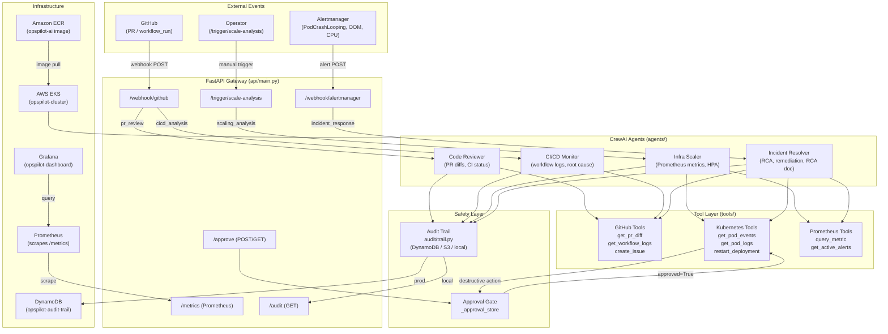
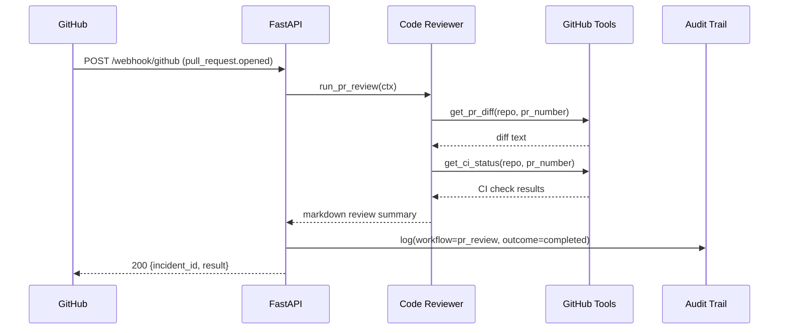
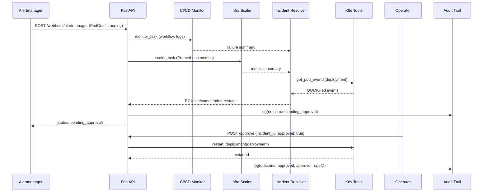

# OpsPilot AI — Architecture

## System Overview

OpsPilot AI is a multi-agent DevOps control plane. External events (GitHub webhooks, Alertmanager alerts) arrive at a FastAPI gateway, which routes them to the appropriate CrewAI agent workflow. All destructive actions are gated behind a human approval step before execution. Every workflow decision is written to an immutable audit trail.

---

## Component Diagram

---

## Data Flow — PR Review

---

## Data Flow — Full Incident Response with Approval Gate

---

## Component Table

| Component | File(s) | Purpose |
|-----------|---------|---------|
| FastAPI gateway | `api/main.py` | Webhook ingestion, approval gate, `/metrics`, `/audit` |
| Code Reviewer | `agents/code_reviewer.py` | PR diff analysis, test gap detection |
| CI/CD Monitor | `agents/cicd_monitor.py` | Pipeline log parsing, root-cause identification |
| Infra Scaler | `agents/infra_scaler.py` | Prometheus-driven replica recommendations |
| Incident Resolver | `agents/incident_resolver.py` | RCA correlation, remediation + draft docs |
| Crew orchestrator | `workflows/crew.py` | 4 workflow entry points, audit trail wiring |
| Tool factory | `tools/__init__.py` | Selects real vs. mock tools via `APP_ENV` |
| Mock tools | `tools/mock_tools.py` | Realistic hardcoded responses for local dev |
| Real tools | `tools/github_tools.py` etc. | Live GitHub / K8s / Prometheus calls |
| Approval gate | `api/main.py` `_approval_store` | Blocks destructive K8s actions until approved |
| Audit trail | `audit/trail.py` | Immutable event log — DynamoDB/S3/local |
| Eval framework | `eval/metrics.py` | Keyword precision/recall scorer, 20 test cases |
| EKS cluster | `infra/eks/cluster.yaml` | eksctl-managed 2–6 node managed node group |
| Helm chart | `infra/helm/opspilot/` | Deployment, HPA, Ingress, ServiceAccount (IRSA) |
| Grafana dashboard | `infra/grafana/` | 9-panel ops dashboard, auto-imported via ConfigMap |
| CI/CD pipeline | `.github/workflows/ci.yml` | lint → test → ECR push → helm deploy |

---

## Environment Modes

| `APP_ENV` | Tools used | LLM | Audit backend |
|-----------|-----------|-----|---------------|
| `development` | `mock_tools.py` | Gemini (real) | `local` (JSONL file) |
| `staging` | real GitHub/K8s/Prometheus | Gemini (real) | `s3` |
| `production` | real GitHub/K8s/Prometheus | Gemini (real) | `dynamodb` |

---

## Secret Management

**Local dev:** `.env` file (never committed — in `.gitignore`)

**EKS production:** AWS Secrets Manager via IRSA. The `opspilot-sa` ServiceAccount has IAM permissions scoped to `secretsmanager:GetSecretValue` for paths under `opspilot/*`. Secrets are injected as env vars from the `opspilot-secrets` K8s Secret (created by `deploy_eks.sh` from `.env`).

For fully automated secret rotation, deploy the [External Secrets Operator](https://external-secrets.io) and apply `infra/eks/external-secrets.yaml`.
